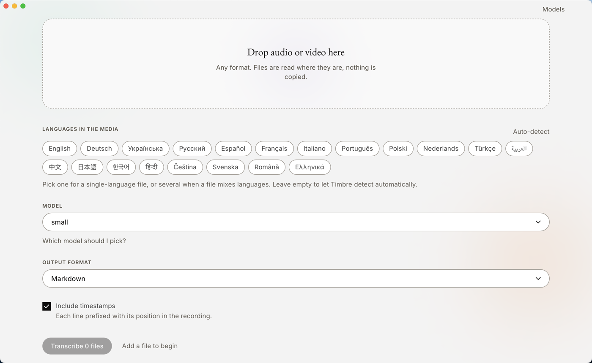
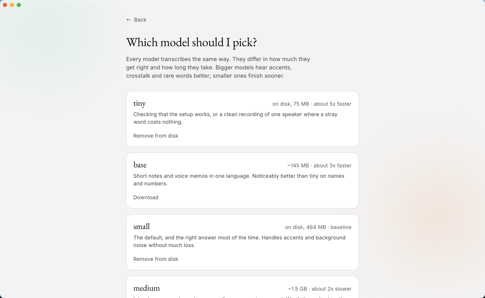

# Timbre

[](https://github.com/dpaguba/timbre/actions/workflows/ci.yml)
[](./LICENSE)

Transcribe unlimited audio and video files into a single, well-organised
document, fully **local** and fully **free**. Nothing is uploaded anywhere:
transcription runs on your own machine with [faster-whisper](https://github.com/SYSTRAN/faster-whisper),
and the app is only ever served on `localhost`.



## Features

- **Any format, any number of files.** The bundled decoder reads MP3, WAV, M4A, MP4, MOV,
  MKV, AVI and essentially anything else, so there is no format list to
  maintain.
- **One combined transcript** with a clearly labelled section per source file.
- **Multi-language aware.** Pick the languages you expect. Choose one to force
  it, several when a file mixes languages (per-segment detection kicks in), or
  none to auto-detect.
- **Choose your output format:** TXT, Markdown, or Word (DOCX).
- **Selectable model** (tiny → large-v3) to trade speed for accuracy.
- **Offline and private** after the one-time model download. No API keys, no
  cloud, no telemetry, and no font or asset CDN: everything the interface needs
  ships with it.
- **Nothing to install.** The desktop build carries its own Python, decoder and engine.
- **A real application.** System open and save panels, a menu with the shortcuts
  you would try, drag from Finder, progress on the dock icon, and a notification
  when a long job finishes.

## Install

Download the build for your system from the
[releases page](https://github.com/dpaguba/timbre/releases), open it, and
start transcribing. Python, ffmpeg and the transcription engine are inside the
download; there is nothing to install first.

| System | File |
|---|---|
| macOS, Apple Silicon | `Timbre_*_aarch64.dmg` |
| macOS, Intel | `Timbre_*_x64.dmg` |
| Windows | `Timbre_*_x64-setup.exe` |

These builds are not signed with a paid certificate yet, so the first launch
needs one extra step. On macOS, right-click the app and choose Open, then
confirm. On Windows, choose More info and then Run anyway. Both systems
remember the decision.

The first run downloads one transcription model, about 480 MB for the
recommended one. That is the only time the app uses the network. Everything
after it happens on your machine, offline.

Models can be added and removed later, and the app explains what each one is
good for rather than leaving you to guess from a size.



## Running from source

For development, or to run it as a local web app instead of a desktop one.

**Requirements:** Python 3.10+ and Node.js 18+. No ffmpeg: decoding goes
through PyAV, which carries the ffmpeg libraries itself.

```bash
git clone https://github.com/dpaguba/timbre.git
cd timbre
./start.sh          # macOS and Linux
```

```powershell
.\start.ps1         # Windows
```

Then open <http://localhost:8000>.

## Development

Run backend and frontend separately with hot reload:

```bash
./dev.sh          # macOS / Linux
```

```powershell
.\dev.ps1         # Windows
```

- Frontend (Vite): <http://localhost:5173>
- Backend (FastAPI docs): <http://localhost:8000/docs>

The Vite dev server runs on a different port, so the backend needs
`TIMBRE_DEV=1` to accept requests from it. `dev.sh` and `dev.ps1` set this
for you. A normal `start.sh` run serves the frontend itself and refuses
cross-origin requests, which is what keeps another site in another tab from
driving your local server.

## Batch mode (transcribe a whole folder)

For many large files, use the batch command instead of the web upload. It
processes every media file in a folder **one by one** into a single document,
saves progress after each file, and **resumes** if interrupted (already-done
files are skipped on the next run).

```bash
# macOS / Linux
./batch.sh --input /path/to/videos --languages ru,uk,en --model small --format md

# Windows (PowerShell)
.\batch.ps1 --input C:\path\to\videos --languages ru,uk,en --model small --format md
```

Options: `--input` folder or `--files FILE [FILE ...]` (specific files instead
of a whole folder), `--output` file (default `<input>/transcript.<fmt>`),
`--model` (tiny/base/small/medium/large-v3), `--languages` (comma-separated ISO
codes, empty = auto-detect), `--format` (txt/md/docx), `--no-timestamps`,
`--limit N` (first N only, for a quick test).

Transcribe just a few specific files into their own document:

```bash
./batch.sh --files "video1.mp4" "video2.mp4" --output ~/notes.md --languages ru,uk,en --model small
```

The combined document and a `<output>.progress.json` cache are written next to
each other. Delete the cache to start over.

## How it works

```
┌────────────┐    upload     ┌──────────────┐    decode    ┌──────────────┐
│  React SPA │ ────────────▶ │   FastAPI    │ ───────────▶ │  16 kHz WAV  │
│ (Vite/TS)  │   /api/jobs   │ job manager  │              └──────┬───────┘
└─────▲──────┘               └──────┬───────┘                     │
      │                             │                             ▼
      │  poll /api/jobs/{id}        │  combine + export    ┌──────────────┐
      │                             │                      │faster-whisper│
      │     transcript.{txt,md,docx}│                      │  (offline)   │
      └─────────────◀───────────────┘◀─────────────────────└──────────────┘
```

The backend keeps job state in memory, with no database, because it is a
single-user local tool. Uploads and generated files live under `backend/data/`
when you run from source, and under the per-user application data directory in
the desktop build: `~/Library/Application Support/one.timbre.app/data` on
macOS, `%LOCALAPPDATA%\one.timbre.app\data` on Windows.

## Configuration

Everything works out of the box. Optional environment variables:

| Variable                 | Default              | Purpose                             |
| ------------------------ | -------------------- | ----------------------------------- |
| `TIMBRE_MODEL`        | `small`              | Default Whisper model               |
| `TIMBRE_DEVICE`       | `auto`               | `auto`, `cpu`, or `cuda`            |
| `TIMBRE_COMPUTE_TYPE` | `int8` (CPU)         | e.g. `int8`, `float16`, `float32`   |
| `TIMBRE_MODEL_DIR`    | HF cache             | Where models are downloaded         |
| `TIMBRE_DATA_DIR`     | see [How it works](#how-it-works) | Uploads + outputs directory |
| `TIMBRE_RETENTION_DAYS` | `7`                | Days before old uploads and transcripts are deleted. `0` keeps everything |
| `TIMBRE_MAX_UPLOAD_BYTES` | `4294967296` (4 GB) | Largest single file accepted, in bytes |
| `TIMBRE_MAX_JOB_BYTES` | `17179869184` (16 GB) | Largest total upload per job, in bytes |
| `TIMBRE_PRUNE_INTERVAL_SECONDS` | `21600` (6 h) | How often a running server sweeps old data |
| `TIMBRE_DEV`          | unset                | Set to `1` to accept the Vite dev server origin |
| `TIMBRE_TOKEN`           | unset                | Bearer token every API call must carry. The desktop shell sets a random one per launch; set it yourself to protect a run from source |

### Housekeeping

Media files are large and transcripts pile up beside them. On every start the
app deletes uploads and outputs older than `TIMBRE_RETENTION_DAYS`. The
intermediate 16 kHz WAVs are removed as soon as each job finishes. Pruning runs
at startup and then every `TIMBRE_PRUNE_INTERVAL_SECONDS`, and it skips any
job that is still queued or running. Set the retention to `0` to keep
everything and manage the data directory yourself.

The size limits exist to turn a mistake into a clear error rather than a full
disk. Raise them if you genuinely work with files that big.

## Limitations

Worth knowing before you rely on it:

- **Jobs live in memory.** Restarting the server loses the queue and the
  progress of anything running. Finished transcripts already written to the
  data directory survive; work in flight does not.
- **One process, one machine.** The app is built to be served on `localhost`
  for a single user and binds to `127.0.0.1` deliberately. The desktop build
  requires a per-launch token on every API call; the browser build has no
  accounts and relies on the request coming from its own page. Neither is a
  substitute for authentication on a shared host. See [SECURITY.md](./SECURITY.md).
- **Local files are never copied.** The desktop build hands the transcriber a
  path, so a four gigabyte recording starts immediately. The browser build has
  no path to give and uploads instead.
- **The first run downloads a model.** Depending on the size chosen this is
  between roughly 75 MB (`tiny`) and 3 GB (`large-v3`), cached afterwards.

## Testing

```bash
cd backend
source .venv/bin/activate      # the venv start.sh already created
pip install -r requirements-dev.txt
pytest
ruff check app tests
```

Installing without activating the venv first fails on any modern Linux or
Homebrew Python with `error: externally-managed-environment`.

```bash
(cd frontend && npm run lint && npm run typecheck && npm run build)
(cd desktop/src-tauri && cargo fmt --check && cargo clippy -- -D warnings)
```

Clippy compiles the embedded SPA, so the frontend build has to come first.
CI runs all of it on every pull request.

## Contributing

Issues and pull requests are welcome. [CONTRIBUTING.md](./CONTRIBUTING.md) has
the project layout and the conventions; participation is covered by the
[Code of Conduct](./CODE_OF_CONDUCT.md). Security problems go through the
Security tab rather than a public issue, see [SECURITY.md](./SECURITY.md).

## License

Timbre's own source is [MIT](./LICENSE) © Dmytro Pahuba.

The released desktop binaries are a different matter: they bundle FFmpeg
libraries built with x264 and x265, which are GPL-2.0-or-later, so a downloaded
build is distributed under GPL-2.0-or-later as a combined work.
[NOTICE.md](./NOTICE.md) explains why and lists every third-party component.
